# Visual Guide

This page provides visual diagrams to help you understand OpenCDMP's architecture, workflows, and concepts.

## System Architecture

### High-Level Architecture

**Key Components**:

- **Webapp**: User-facing Angular application for creating and managing Plans
- **API Service**: Core backend managing all business logic and data
- **Keycloak**: Centralized authentication and user management
- **PostgreSQL**: Primary data storage for Plans, Descriptions, and configurations
- **Elasticsearch**: Fast full-text search across Plans and Descriptions
- **RabbitMQ**: Asynchronous messaging between services
- **Supplementary Services**: Optional but recommended services for notifications and comments
- **Integration Services**: Pluggable services for external integrations

---

## Plan Lifecycle

### Plan States and Transitions

**State Descriptions**:

- **Draft**: Active editing state. All Contributors can add/edit Descriptions. Plan structure can be modified.
- **Finalized**: Content is locked. Plan is ready for submission or deposit. Metadata (title, description) can still be updated.
- **Published**: Plan has been deposited to an external repository (Zenodo, Dataverse, etc.) and has a DOI assigned. Content is archived and publicly accessible.

---

## User Roles and Permissions

### Plan-Level Roles

```mermaid
graph LR
    subgraph "Plan Roles"
        Owner["Owner<br/>👑<br/>Full Control"]
        Contributor["Contributor<br/>✏️<br/>Can Edit"]
        Reviewer["Reviewer<br/>👁️<br/>Can Comment"]
        Viewer["Viewer<br/>📖<br/>Read Only"]
    end

    Owner -->|Can do everything| Everything["• Edit Plan<br/>• Add/Remove Descriptions<br/>• Manage Users<br/>• Finalize/Publish<br/>• Delete Plan"]

    Contributor -->|Can edit content| EditPerm["• Edit Plan<br/>• Add/Remove Descriptions<br/>• Export Plan"]

    Reviewer -->|Can review| ReviewPerm["• View Plan<br/>• Add Comments<br/>• Request Changes"]

    Viewer -->|Can view| ViewPerm["• View Plan<br/>• Export Plan"]

    style Owner fill:#ffd700
    style Contributor fill:#90ee90
    style Reviewer fill:#87ceeb
    style Viewer fill:#d3d3d3
```

### System-Level Roles

---

## Plan Structure

### Blueprint Hierarchy

```mermaid
graph TD
    Blueprint["Blueprint<br/>(Plan Template)"]

    Blueprint --> Section1["Section 1<br/>Project Info"]
    Blueprint --> Section2["Section 2<br/>Data Collection"]
    Blueprint --> Section3["Section 3<br/>Data Storage"]

    Section1 --> Desc1["Description 1<br/>(Dataset Template)"]
    Section2 --> Desc2["Description 2<br/>(Dataset Template)"]
    Section2 --> Desc3["Description 3<br/>(Software Template)"]
    Section3 --> Desc4["Description 4<br/>(Dataset Template)"]

    Desc1 --> Fields1["Fields:<br/>• Dataset Name<br/>• Format<br/>• Size"]
    Desc2 --> Fields2["Fields:<br/>• Collection Method<br/>• Collection Period<br/>• Responsible Person"]
    Desc3 --> Fields3["Fields:<br/>• Software Name<br/>• Version<br/>• License"]

    style Blueprint fill:#e1f5ff
    style Section1 fill:#fff4e1
    style Section2 fill:#fff4e1
    style Section3 fill:#fff4e1
    style Desc1 fill:#e1ffe1
    style Desc2 fill:#e1ffe1
    style Desc3 fill:#e1ffe1
    style Desc4 fill:#e1ffe1
```

**Hierarchy Explanation**:

1. **Blueprint**: Defines the overall structure of a Plan (e.g., "NSF Data Management Plan")
2. **Sections**: Major divisions within a Plan (e.g., "Project Information", "Data Management")
3. **Description Templates**: Define what types of Descriptions can be added to each section (e.g., "Dataset", "Software")
4. **Descriptions**: Actual instances created by users (e.g., "RNA Sequencing Dataset 2024")
5. **Fields**: Individual data points within a Description (text, numbers, dates, references, etc.)

---

## Authentication Flow

### OAuth2 Authorization Code Flow

---

## Data Flow Examples

### Creating a Plan

### Adding a Description

### Exporting a Plan

### Publishing to Repository

---

## Notification System

### Event-Driven Notifications

**Notification Types**:

- **Plan Invitation**: User is invited to collaborate on a Plan
- **Description Assigned**: User is assigned to work on a Description
- **Comment Added**: New comment on a Plan/Description the user is involved with
- **Plan Finalized**: Plan is finalized and ready for review/submission
- **Plan Published**: Plan is successfully deposited and has DOI
- **System Announcements**: Admin notifications to all users

---

## Search and Indexing

### Elasticsearch Integration

**Search Capabilities**:

- Full-text search across Plan titles, descriptions, and content
- Search within Description fields
- Filter by status (Draft, Finalized, Published)
- Filter by Blueprint type
- Filter by user role (My Plans, Shared with Me)
- Faceted search with aggregations

---

## Multi-Tenancy

### Tenant Isolation

**Tenant Isolation**:

- Each tenant has separate users, Plans, and configurations
- Data is logically separated by tenant ID
- Users cannot see or access other tenants' data
- Each tenant can have custom Blueprints and Templates
- Shared default templates available across tenants (optional)

---

## Deployment Architecture

### Docker Compose Deployment

**Container Roles**:

- **Nginx**: Reverse proxy handling SSL/TLS termination and routing
- **Webapp**: Serves Angular frontend application
- **Backend**: Java API service handling all business logic
- **Keycloak**: Authentication server
- **PostgreSQL**: Primary database
- **Elasticsearch**: Search index
- **RabbitMQ**: Message broker
- **Services**: Supplementary microservices
- **Transformers**: File format conversion services
- **Deposit**: Repository integration services

---

## Integration Patterns

### File Transformer Integration

### Repository Deposit Integration

---

## Performance Optimization

### Caching Strategy

**Cached Data**:

- Blueprints (rarely change)
- Description Templates (rarely change)
- Reference Types (rarely change)
- User permissions (TTL: 5 minutes)
- Keycloak configuration (TTL: 15 minutes)

**Cache Invalidation**:

- Manual admin action (clear cache)
- Time-to-live (TTL) expiration
- On entity update (automatic)

---

## Backup and Recovery

### Backup Strategy

---

## Related Documentation

### Getting Started
- [Architecture Overview](/getting-started/architecture.md)
- [Deployment Guide](/getting-started/deployment/index.md)
- [Configuration](/getting-started/configuration/backend/)
- [Common Workflows](/getting-started/getting-started-workflows.md)

### User Guides
- [Your First Plan](/user-guide/getting-started.md)

### Administration
- [Administrator Getting Started](/admin-guide/getting-started.md)
- [Blueprint Management](/admin-guide/content-management/blueprints/)
- [User Management](/admin-guide/user-management/users.md)

### Integration
- [OAuth2 Integration](/developers/integration.md)
- [Supplementary Services](/optional-services/deposit-services.md)

---

## Diagram Legend

**Color Coding**:
- 🔵 Blue: User interface components
- 🟡 Yellow: Backend services
- 🔴 Red: Authentication/security
- 🟢 Green: Data storage
- 🟣 Purple: Message queues
