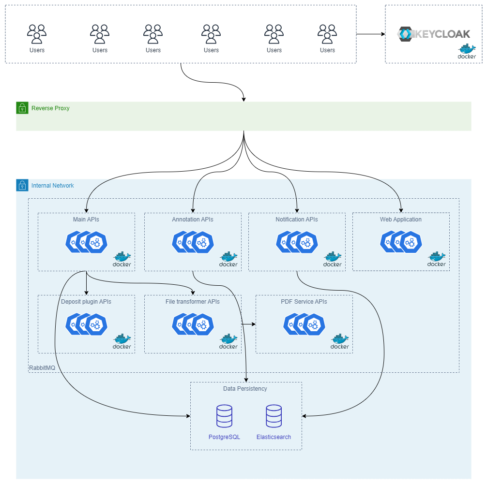

# System Architecture

OpenCDMP is designed using a **microservices architecture**, leveraging Docker containers for deployment and scalability. This approach allows each component of the system to be developed, deployed, and scaled independently, ensuring flexibility and robustness in managing Output Management Plans (OMPs).

## Overview

The architecture comprises multiple services, each responsible for specific functionalities within the OpenCDMP platform. These services communicate with each other through well-defined APIs and messaging queues, ensuring seamless integration and data flow.

Below is a list of the services included in the architecture:

- **Nginx Reverse Proxy**: Acts as the entry point and reverse proxy. It is the only service that needs external connectivity.
- **API Service**: Main APIs handling the core business logic.
- **Webapp Service**: Frontend of the application, providing the user interface.
- **Notification Service**: Handles notifications (Email and In-App). *Closed source project, but with a free-to-use license.*
- **Annotation Service**: Manages annotations (comments) and reviews. *Closed source project, but with a free-to-use license.*
- **Repository Deposit Services**: Multiple services acting as deposit plugins to repositories for DOI assignment.
- **File Transformation Services**: Multiple services acting as export/import plugins for file transformations.
- **Keycloak**: Authentication server for managing users and roles.
- **PostgreSQL**: Main database storage for persisting data.
- **RabbitMQ**: Message broker for microservices intercommunication.
- **Elasticsearch**: Used for indexing and searching data.
- **PDF Generator Service**: Generates PDF documents from Plans.

The following diagram provides a high-level overview of the architecture:

### **Services Breakdown**

#### **Nginx Reverse Proxy**

- **Purpose**: Acts as the gateway to the application, routing incoming HTTP/HTTPS requests to the appropriate internal services.
- **Features**:
  - SSL termination
  - Load balancing
  - Reverse proxying to backend services
- **Notes**:
  - It is the only service exposed to the external network.
  - Enhances security by hiding internal services from direct external access.

#### **API Service**

- **Purpose**: Serves as the main backend, handling core business logic and API endpoints.
- **Features**:
  - Processes requests from the Webapp Service.
  - Interacts with PostgreSQL for data persistence.
  - Interacts with Elasticsearch for indexing.
  - Evaluating authentication against Keycloak.
  - Communicates with other microservices via RabbitMQ.
  - Implements RESTful APIs for frontend consumption.

#### **Webapp Service**

- **Purpose**: Provides the frontend user interface for OpenCDMP.
- **Features**:
  - Built using modern web technologies.
  - Communicates with the API Service.
  - Offers a user-friendly interface for managing Plans, Blueprints, Templates, etc.

#### **Notification Service**

- **Purpose**: Manages email and in-app notifications.
- **Features**:
  - Sends notifications based on events (e.g., Annotations added, Plan updates, Invitations).
  - *Closed source*, but available under a free-to-use license.
- **Notes**:
  - Communicates with other services via RabbitMQ.
  - Configurable notification preferences.
  - Configurable notification templates.

#### **Annotation Service**

- **Purpose**: Handles annotations (comments) and the review process.
- **Features**:
  - Allows reviewers to add annotations to Plans or specific Sections.
  - Tracks annotation statuses for lifecycle management.
  - *Closed source*, but available under a free-to-use license.
- **Notes**:
  - Enhances collaboration and quality control.

#### **Repository Deposit Services**

- **Purpose**: Deposits OMPs to external repositories for DOI assignment.
- **Features**:
  - Multiple services acting as plugins for different repositories.
  - Pluggable mechanism to implement custom deposit plugins.
- **Examples**:
  - Integration with repositories like Zenodo, Dataverse, etc.

#### **File Transformation Services**

- **Purpose**: Manages export/import functionalities.
- **Features**:
  - Supports exporting Plans and Descriptions in formats like XML, JSON, DOCX, and PDF.
  - Multiple services acting as plugins for different file transformations.
  - Pluggable mechanism to implement custom export/import plugins.

#### **Keycloak**

- **Purpose**: Provides authentication and authorization.
- **Features**:
  - Manages user identities, roles, and permissions.
  - Supports protocols like OpenID Connect, OAuth 2.0, and SAML 2.0.
- **Notes**:
  - Centralized security management.
  - Integrates with the Webapp and API Services for secure access control.

#### **PostgreSQL**

- **Purpose**: Main relational database for storing application data.
- **Features**:
  - Stores data for Plans, Users, Templates, Annotations, etc.
  - Provides data integrity and transactional support.
- **Notes**:
  - Ensures reliable data persistence.
  - Scalable and supports complex queries.

#### **RabbitMQ**

- **Purpose**: Message broker facilitating communication between microservices.
- **Features**:
  - Supports asynchronous messaging.
  - Enhances scalability and decouples services.
- **Notes**:
  - Critical for inter-service communication.
  - Improves system resilience.

#### **Elasticsearch**

- **Purpose**: Provides powerful search and indexing capabilities.
- **Features**:
  - Enables full-text search over various data fields.
  - Real-time data indexing.
- **Notes**:
  - Enhances user experience with quick and efficient search functionality.

#### **PDF Generator Service**

- **Purpose**: Generates PDF documents from Plans.
- **Features**:
  - Converts Plans into professional PDF formats.
  - Supports custom templates and styling.
- **Notes**:
  - Facilitates easy sharing and presentation of Plans.