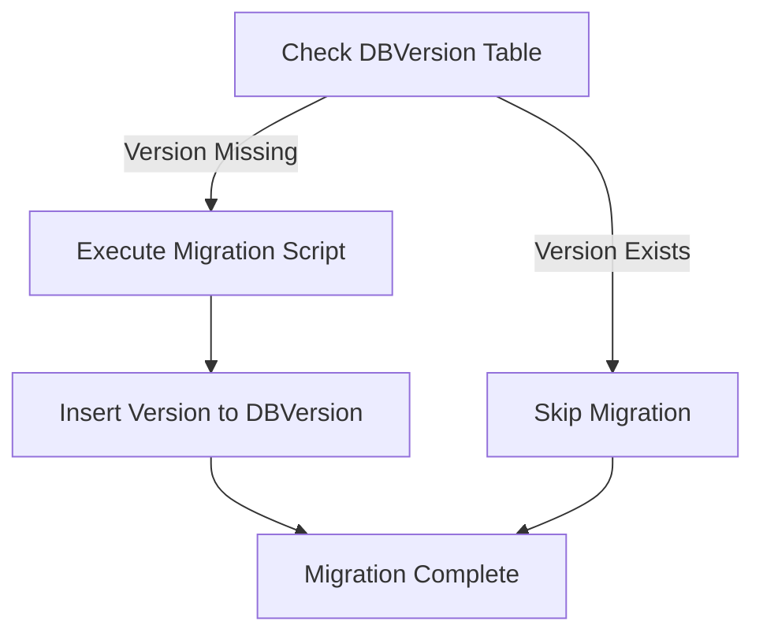

# Upgrade Guide

This guide provides instructions for upgrading your OpenCDMP installation to newer versions, including database migration procedures.

---

## Pre-Upgrade Steps

### 1. Review Release Notes

Check the [OpenCDMP Releases](https://github.com/OpenCDMP/OpenCDMP/releases) page for:

- **New features** and changes
- **Database migrations** required
- **Configuration changes** needed
- **Known issues**

### 2. Backup Your Data

:::danger Critical
Always back up before upgrading. This is your safety net for rollback.
:::

---

## Upgrade Process

### Step 1: Stop Services

Stop all OpenCDMP services:

```bash
docker-compose down
```

### Step 2: Update Environment Variables and Docker Tags

Update the `.env` file in your [docker-deployment](https://github.com/OpenCDMP/docker-deployment) configuration. Edit the `.env` file and update OpenCDMP version tags:
   - `MAIN_APP_TAG` - Backend version
   - `WEBAPP_TAG` - Frontend version
   - Other service tags as needed


:::tip
The `.env` file contains all version tags and configuration variables used by the [docker-compose.yml](https://github.com/OpenCDMP/docker-deployment/blob/main/docker-compose.yml).
:::

### Step 3: Update Configuration Files

Check release notes and update configuration files for **all services**:

1. **Backend** (typically `app.env` or similar):
   - Add new environment variables
   - Update changed values
   - Remove deprecated variables

2. **Notification Service**:
   - Update configuration if needed

3. **Annotation Service**:
   - Update configuration if needed

4. **Other Services**:
   - Update any other service configurations

:::tip
Compare your configuration files with the latest templates in the [Configuration Documentation](../configuration/index.md).
:::

### Step 4: Run Database Migrations (If Needed)

Database migrations are applied through SQL scripts from the GitHub repository:

👉 [OpenCDMP/db](https://github.com/OpenCDMP/OpenCDMP/tree/main/db)

#### Understanding Database Migrations

Each migration script follows a naming convention with a **version number**, for example:
- `01.00.002_Insert_values_Workflows_Tenant_config.sql`

When a script is executed, its version is stored in the **`DBVersion`** table inside the database. Before any script runs, the system checks whether the corresponding version already exists in the table:
- If it **exists**, the script will *not* run again
- If it **does not exist**, the script will be executed and the version will be recorded

This mechanism prevents duplicate executions and ensures updates are applied in the correct order.

:::note
Database migration scripts are different from initialization scripts that run when PostgreSQL starts for the first time. More information about initialization scripts can be found in the [PostgreSQL Configuration](../configuration/infrastructure/postgres.md#initialization-database-scripts).
:::

#### Migration Workflow



#### Check Current Database Version

Query the `DBVersion` table to see which scripts have been executed:

```sql
SELECT * FROM "DBVersion" ORDER BY version DESC;
```

:::note
If there are scripts in the `db/` folder with version numbers that do not appear in the table, they must be executed manually.
:::

#### Apply Missing Migrations

1. **Identify missing migrations**: Compare scripts in the `db/` folder with versions in the `DBVersion` table
2. **Execute migrations in order**: Run each missing script using your preferred method (psql, database client, etc.)
3. **Verify**: Check that the version appears in the `DBVersion` table

:::warning
Execute migration scripts in version order. Do not skip versions.
:::

#### If Migration Fails

If a migration fails:
1. Check the error message
2. Review database logs
3. Common issues:
   - Constraint violations: Check data consistency
   - Permission errors: Verify user permissions
   - Syntax errors: Check SQL syntax
4. Rollback to backup if needed

### Step 5: Start Services

Start all services:

```bash
docker-compose up -d
```

Monitor logs during startup:

```bash
docker-compose logs -f
```

### Step 6: Verify Upgrade

Test critical functionality:
- [ ] All services are running
- [ ] Health check endpoint responds
- [ ] Users can log in
- [ ] Create a new Plan
- [ ] Edit an existing Plan
- [ ] Export functionality works (PDF, DOCX)
- [ ] Search works correctly
- [ ] Admin functions accessible

---

## Rollback Procedures

If the upgrade fails or causes issues:

1. **Stop services**: `docker-compose down`
2. **Restore database** from backup
3. **Restore files** from backup
4. **Restore configuration files** from backup
5. **Revert to previous Docker image tags** in `docker-compose.yml`
6. **Start services**: `docker-compose up -d`
7. **Verify rollback** - test basic functionality

---

## Troubleshooting

### Services Won't Start

**Check**:
- Database is running and accessible
- Configuration files are correct (no typos, all required variables set)
- Ports are not already in use
- Container logs for specific errors

### Database Migration Failed

**Check**:
- SQL syntax is correct
- Database user has proper permissions
- Data consistency (constraints, foreign keys)
- Review the specific migration script carefully

### Authentication Fails After Upgrade

**Check**:
- Keycloak service is running
- `IDP_ISSUER_URI` configuration is correct
- Client configuration in Keycloak hasn't changed
- Network connectivity between services

### Frontend Errors

**Check**:
- Backend is running and accessible
- Backend configuration (especially database connection)
- CORS configuration
- API health endpoint responds
- Browser console for specific errors

---

## Post-Upgrade Checklist

- [ ] All services running
- [ ] Health check passes
- [ ] Critical functionality tested
- [ ] No errors in logs
- [ ] Users notified that upgrade is complete
- [ ] Internal documentation updated with new version
- [ ] Monitor system for 24-48 hours

---

## Best Practices

### Always Test First
- Test upgrades in staging/development environment first
- Never upgrade production without testing

### Schedule Wisely
- Upgrade during off-peak hours
- Consider time zones for international users

### Communicate
- Notify users when upgrade is complete

### Monitor
- Watch logs for 24-48 hours after upgrade
- Be ready to rollback if needed
- Respond quickly to user issues

### Document
- Keep an upgrade log
- Document any issues and resolutions
- Update internal procedures based on experience

---

## Related Documentation

- [Deployment Guide](index.md) - Initial deployment instructions
- [Configuration Guide](../configuration/index.md) - All configuration options
- [Troubleshooting](/docs/troubleshooting.md) - Common issues and solutions

---

## Support

For upgrade assistance:

- **Release Notes**: Review carefully before upgrading
- **GitHub Issues**: https://github.com/OpenCDMP/OpenCDMP/issues
- **Email**: opencdmp at cite.gr
